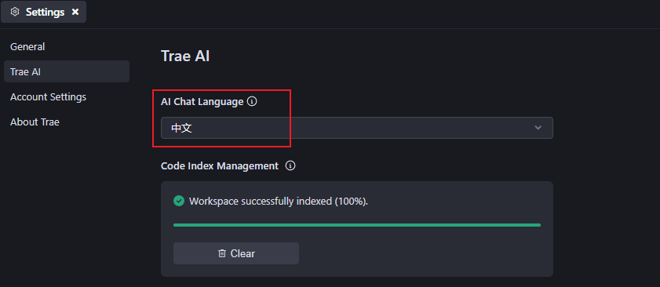
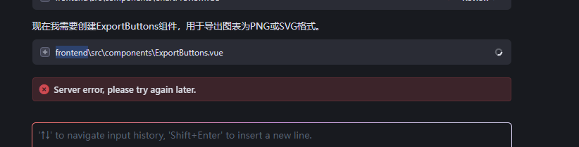
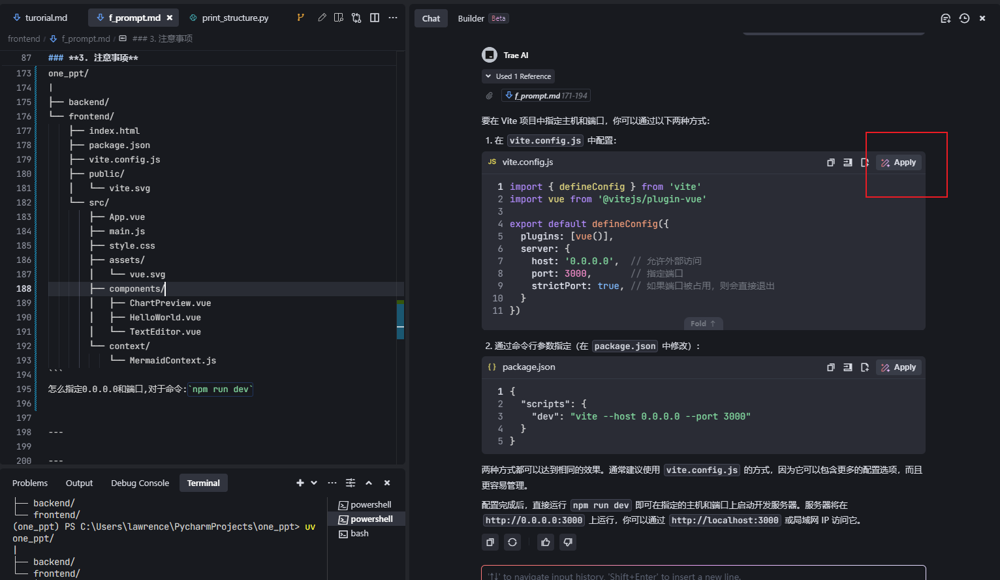

## 探索Trae：字节跳动的免费AI驱动IDE

### Trae 编辑器的介绍
Trae 是字节跳动在 2025 年初推出的一款免费 AI 驱动的集成开发环境（IDE），旨在通过与开发者的协作提升工作效率。它基于 VS Code，继承了其广泛的扩展库和兼容性，同时集成了强大的 AI 功能，如实时代码建议和项目生成。当前，Trae 支持 macOS 和 Windows，Linux 版本尚未提及。

### 关键要点
- 它提供实时代码建议、Builder 模式和多模态支持（如图像解释），由 GPT-4o 和 Claude-3.5-Sonnet 提供支持。  
- 与 Cursor 相比，Trae 免费访问是其主要优势，但存在数据隐私担忧，尤其是与字节跳动相关。  
- Trae 适合学生和非商业项目，但专业开发者可能需要权衡隐私风险。  

#### 主要功能
Trae 的核心功能包括：  
- **AI 辅助编码**：提供实时代码建议，并能根据自然语言提示生成代码片段或整个项目，加速开发流程。  
- **Builder 模式**：采用“思考-行动”方法，分析任务并逐步执行，特别适合复杂项目。  
- **多模态支持**：能解读图像以生成代码，增强了开发者的灵活性。例如，用户可上传 UI 设计图，Trae 可生成相应代码。  
- **用户界面**：界面比其他 VS Code 分支更精致，使用屏幕空间更高效，提供更好的视觉体验。  
- **AI 模型**：由 GPT-4o 和 Claude-3.5-Sonnet 提供支持，确保顶级 AI 能力。  
- **免费访问**：目前完全免费，所有功能均可访问，未来是否收费尚未明确。

#### 与其他 IDE 的比较
Trae 常与 Cursor 等 AI 驱动的 IDE 比较，以下是与 Cursor 的详细对比

| **功能**                     | **Cursor**                                                                 | **Trae**                                                                                     |
|------------------------------|---------------------------------------------------------------------------|---------------------------------------------------------------------------------------------|
| **代码补全**                 | 顶级，理解项目上下文，自动导入（TypeScript、Python），多行补全，自然建议。 | Enter 键建议补全，Tab 接受全部，Ctrl + → 逐词接受，基于注释生成。                           |
| **代码生成/代理**            | Composer（⌘ + I）实现项目架构，Agent 模式（⌘.）处理上下文到终端操作，脚手架应用。 | Builder 模式采用“思考-行动”方法，分析任务，实时预览，通常首次解决方案更准确。               |
| **聊天界面**                 | 上下文感知（⌘ + L），拖放文件夹，支持图像，直接应用代码建议。               | 侧边聊天（⌘ + U）全能 AI，内联聊天（⌘ + I）快速编辑，支持多模态输入（图像、终端输出）。     |
| **上下文感知**               | 查看整个代码库，使用 @Files、@Folders、@Code 引用。                       | 全面使用 #Code、#File、#Folder、#Workspace，自动索引小于 5,000 文件，手动处理更大项目。     |
| **AI 模型**                  | 提供 GPT-4o、o1、Claude 3.5 Sonnet、自定义 cursor-small 模型，基于速度/能力选择。 | 专注于 Claude 3.5 Sonnet 和 GPT-4o，选项有限但均为顶级模型。                                |                             |
| **定价**                     | Pro 20 美元/月，Business 40 美元/用户/月。                                | 目前完全免费，所有功能包含，未来定价待定。                                                 |
| **总体推荐**                 | 更精致，上下文理解优越，项目范围操作流畅，推荐严肃开发。                   | 免费访问是显著优势，适合建立 AI 辅助习惯，需升级到 Cursor 以获得更多功能。                 |

从表中可见，Trae 的免费模式和 Builder 模式是其主要优势，但 Cursor 在上下文感知和定制化方面表现更强。

#### 潜在缺点与争议
尽管 Trae 功能强大，但存在一些争议：  
- **数据隐私担忧**：由于字节跳动是中国公司，用户担心数据隐私和安全，尤其是商业项目。一些评论指出，Trae 的服务条款可能允许使用内容改进服务，引发数据外泄担忧。  

### 实操演示

1. 初步设置

2. 输入提示词,准备开始

3. 执行环境安装

4. 接受文件修改

5. 遇到问题

6. 修改输入提示词,重新开始

7. 完成结束

8. 聊天修改细节

9. 界面展示

### 反思

1. 依赖于别人大模型,对于保密不够
2. 就此界面而言,美观度不够,还需要修改
3. 聊天提示词需要比较专业准确才好
4. 此软件复制文件地址不太方便,烦

### 实操演示-第2天优化

1. 开始聊天-界面优化

2. 界面展示

3. 继续优化

现在好看多了,hh,准备开发后端
